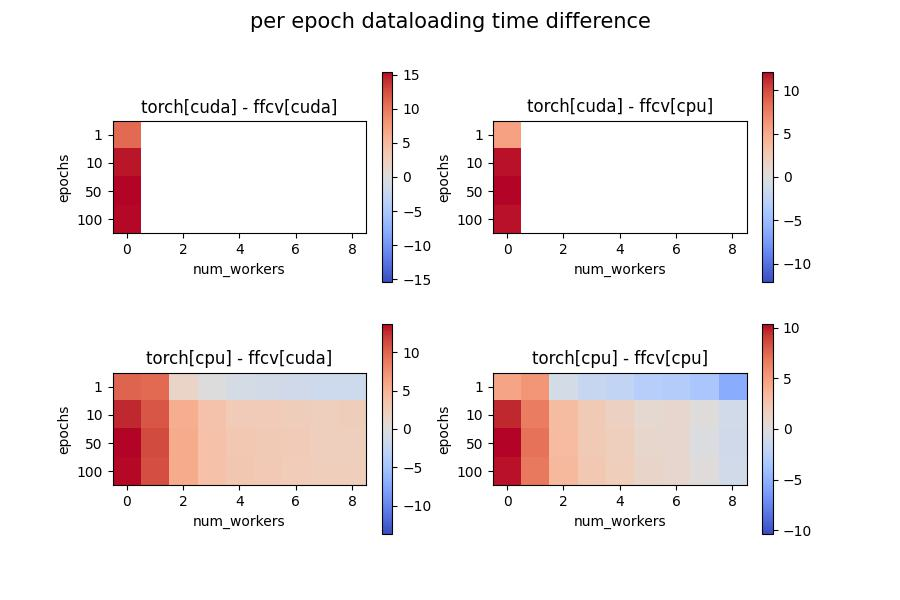
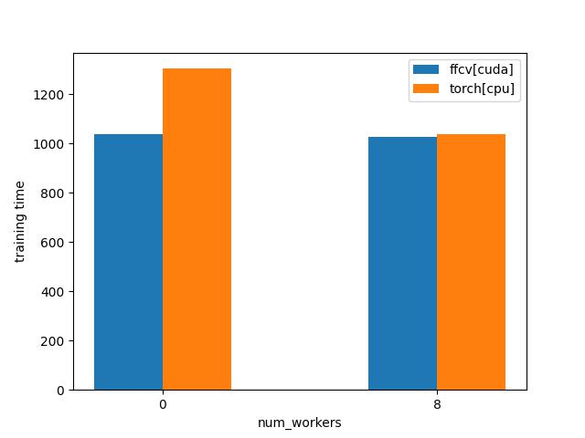

# ffcv-check
Checking how fast data loading and model training on CIFAR10 can be using FFCV GitHub repo https://github.com/libffcv/ffcv.
The utilized machine has an Intel(R) Core(TM) i7-7700K CPU @ 4.20GHz, an NVIDIA GeForce GTX 1080 GPU
and 16GB RAM.

First, you need to create the conda environment with the following commands:
```
conda create -y -n ffcv python=3.9 cupy pkg-config compilers libjpeg-turbo opencv pytorch torchvision cudatoolkit=11.3 numba -c pytorch -c conda-forge
conda activate ffcv
pip install ffcv
```
Then, cifar10_write.py will create the training and test sets' .beton files, required by the FFCV data loader, and store them under ./data/.
Running cifar10_timeit.py will compute the required time for iterating through the dataset
and for training a small neural network on it, either loading the data using FFCV or using
the standard PyTorch dataloader. The corresponding results will be stored under ./results/
and cifar10_results.py will process them and provide us with useful figures and numbers.

## Setup
In this experiment we consider different number of workers (0, 1, 2,..., 8) and different
number of epochs (1, 10, 50, 100) for measuring data loading time using either the FFCV 
dataloader or the standard PyTorch dataloader. In all cases we consider both loading on CPU
and on GPU, except the case of PyTorch dataloader & num_workers>0 for which only loading 
on CPU is enabled. Additionally, we measure the training time that a tiny CNN needs to converge
(~93% accuracy in 24 epochs) using the FFCV and the standard PyTorch dataloaders with their best configuration
in terms of number of workers and device.

## Results
As we can see in the following figure, FFCV on CUDA is not affected by the number of 
workers parameter, while on CPU its performance is increasing up to the number of 4
and then it decreases. In all cases it is observed that when FFCV is utilized only
for one epoch it needs quite long to load but when more epochs are considered the
average time per epoch decreases significantly which is probably caused by
initialization operations.

The PyTorch dataloader on CUDA is very slow and on CPU is faster as the number of
workers increases. More precisely, when 8 workers are utilized it reaches similar
performance as the FFCV on CPU but more than double the time of FFCV on CUDA.
These results are consistent across different number of epochs including 1 in contrast
to FFCV.


The next figure shows the difference in performance between the two dataloaders
in all device combinations. It is obvious that in most cases (30/36=83.3% when 
FFCV-CUDA and PyTorch-CPU) FFCV outperforms PyTorch. If we exclude the experiments
with 1 epoch (that is not the usual case), better PyTorch dataloader performance 
is only observed in CPU-based comparison which is not the best case for FFCV as 
it is for PyTorch. Additionally, the average PyTorch/FFCV loading time ratio is 1.6
on the CPU-based comparison (std 0.9, min 0.3, max 3.7), 22.0 on the CUDA-based 
comparison (std 12.1, min 3.4, max 34.3) and 7.5 when FFCV uses CUDA and PyTorch uses
CPU (std 7.1, min 0.6, max 30.5). 



Finally, in terms of training time using the best configurations of both FFCV and PyTorch
it observed that with 0 workers there is a significant difference in favor of FFCV
while with 8 workers this difference exists but is reduced to minimum.



## Conclusions
FFCV does provide a faster dataloader than the standard PyTorch dataloader but the 
decrease as measured on our apparatus is not so significant as mentioned in the
original repo. The reason for that might be the computational power difference, as
training time on faster devices (e.g. 8xA100) is much more affected from loading 
latency than on slower ones where loading is less of a burden.
