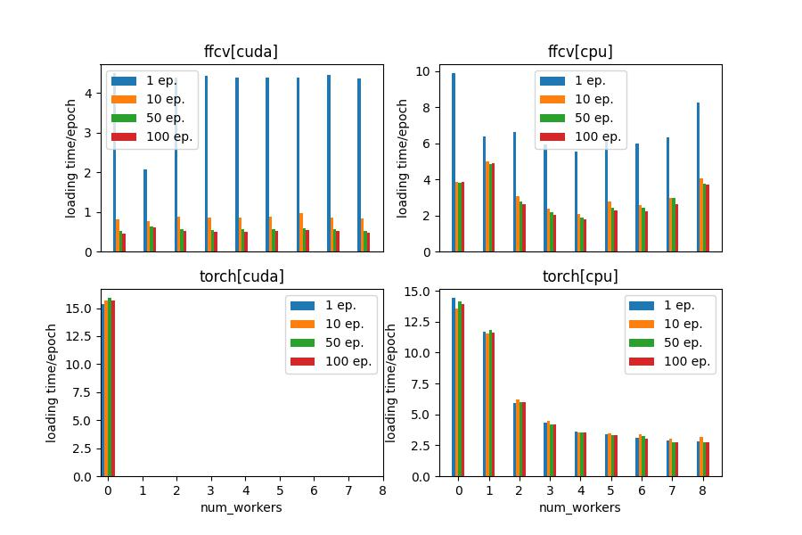

# ffcv-check
Checking how fast data loading and model training on CIFAR10 can be using FFCV GitHub repo https://github.com/libffcv/ffcv.
The utilized machine has an Intel(R) Core(TM) i7-7700K CPU @ 4.20GHz, an NVIDIA GeForce GTX 1080 GPU
and 16GB RAM.

First, you need to create the conda environment with the following commands:
```
conda create -y -n ffcv python=3.9 cupy pkg-config compilers libjpeg-turbo opencv pytorch torchvision cudatoolkit=11.3 numba -c pytorch -c conda-forge
conda activate ffcv
pip install ffcv
```
Then, cifar10_write.py will create the .beton files and store them under ./data/, for the training and test sets, required by the FFCV data loader.
Running cifar10_timeit.py will compute the required time for iterating through the dataset
and for training a small neural network on it, either loading the data using FFCV or using
the standard PyTorch dataloader. The corresponding results will be stored under ./results/
and cifar10_results.py will process them and provide us with meaningful figures.

## Scenarios

## Results
